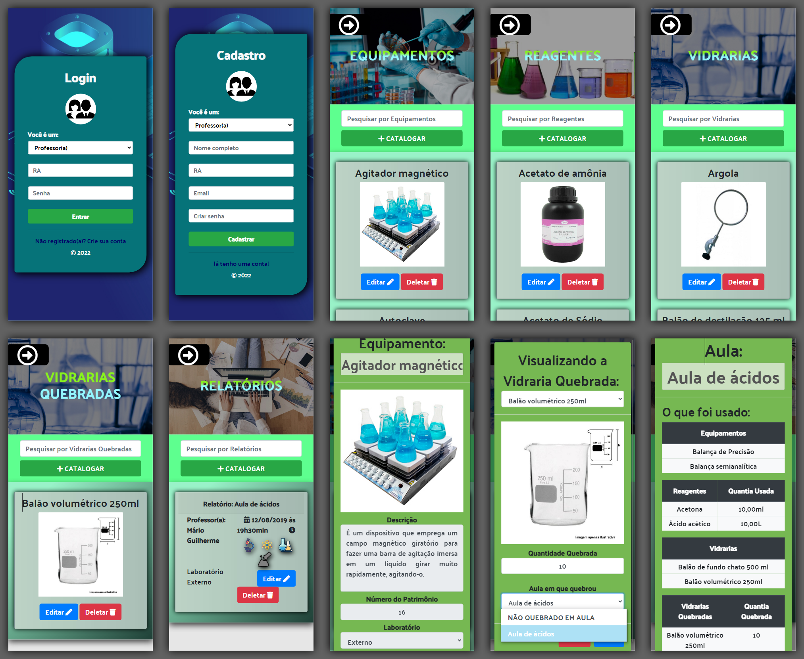

# Laboratórios de Química  


## Sobre
Sistema Web que controla o estoque de dois laboratórios de química em uma instituição, e cada laboratório armazena os equipamentos, reagentes e as vidrarias. O professor, sendo o administrador do sistema, tem permissão adicional de criar, editar e excluir os dados dos equipamentos, reagentes, vidrarias, vidrarias quebradas e os relatórios. Enquanto o aluno, tem apenas permissão de visualização dos dados. O professor, criando o relatório para registrar uma ocorrência de aula, seleciona os itens que foi usado, sendo eles equipamentos, reagentes e vidrarias, e a quantidade de reagente que no final é deduzido da quantia total.

## Por que?
Sistema criado para fazer o controle e manejo do estoque dos laboratórios de química para maior organização dos equipamentos, reagentes e vidrarias na instituição.

## Requisitos
1. PHP 8.0.11 ou superior;
2. Servidor MySQL;
3. Composer;

## Instalação
Passo-a-passo para instalação e configuração do ambiente de desenvolvimento em execução.
Clone o repositório em sua máquina:
```
git clone https://github.com/MarioGuilherme/Laboratorios-Quimica
```
Em seguida execute a instalação das depêndencias pelo composer:
```
composer install
```
Execute em seu SGBD, o seguinte arquivo SQL:
```
App/Database/laboratorios_quimica.sql
```
E por fim, configure o sistema de acordo com o seu ambiente de desenvolvimento no arquivo:
```
App/Config/Configs.php
```

## Funcionalidades
- [x] Cadastrar Usuário
- [x] Login de Usuário
- [x] Logout de Usuário
- [x] CRUD do Equipamento
- [X] CRUD do Reagente
- [X] CRUD da Vidraria
- [X] CRUD do Vidraria Quebrada
- [X] CRUD do Relatório

## Tecnologias e Arquitetura
* HTML
* CSS
* JavaScript
* jQuery 3.6.0
* Fontawesome
* SweetAlert2
* Bootstrap 4
* PHP
* MySQL
* Composer
* MVC
* SPA

## Licença
Distribuído sob a licença MIT. Veja `LICENSE.md` para mais detalhes.

## Deployment
Hospedagem - [Laboratórios de Química](https://laboratoriosquimica.rf.gd)

## Créditos e Desenvolvedores

Mário Guilherme de Andrade Rodrigues – Back-End – [Site](https://marioguilherme.epizy.com)

André Luiz Neves – Front-End – [Facebook](https://www.facebook.com/profile.php?id=100005763971999)

Thiago Kalil Martineli Samara – Front-End – [Facebook](https://www.facebook.com/thiagokalil.martinelisamara)

## Agradecimentos
Sistema desenvolvido durante o **Trabalho de Conslusão de Curso** do **Técnico em Desenvolvimento de Sistemas**, projeto Multidisciplinar com o **Técnico em Açúcar e Álcool** na [ETEC Professora Helcy Moreira Martins Aguiar](https://eteccafelandia.com.br) em 2020.

Agradecemos a todos envolvidos pela colaboração e sugestões.
